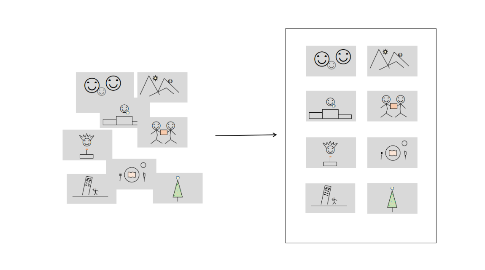

# photo2pdf

* 下载最新稳定版本：
    1. Windows: https://github.com/x2pdf/photo2pdf/releases/tag/v22.01
    2. Mac: https://github.com/x2pdf/photo2pdf/releases/tag/v22.02
* 应用中 Key 的获取方式
    1. 淘宝搜索店铺： x2pdf
    2. 请点访问URL：https://shop436261732.taobao.com/
    3. 如若以上所提供获取的方式，您的情况均不方便或者无法使用的，敬请邮件联系：x2pdf@outlook.com。

* Download the latest stable version:
    1. Windows: https://github.com/x2pdf/photo2pdf/releases/tag/v22.01
    2. Mac: https://github.com/x2pdf/photo2pdf/releases/tag/v22.02
* How to get the Key in the application
    1. Taobao search store: x2pdf
    2. Please visit the URL: https://shop436261732.taobao.com/
    3. If the methods provided above are inconvenient or unavailable for your situation, please email:
       x2pdf@outlook.com.

## 愿景

将精彩美好的图片归一为PDF，以便您随想随用。

## 主要功能简介

 

1.化繁为简——种种美好回忆和精彩，归一化的为您呈现
   

2.连结，在一起——种种美好，一份又一份，归一再归一
   

3.隐私，您的自由——您的密码您知道，您的隐私您掌控
   

4.来去，自如——多种格式自由变换，美好画面始终如一
   

## DEVELOPERS
开发相关信息，请参考 README_DEV.MD 中的指引。

## 声明

 
本 Readme 中描述不清、描述不符、描述不全面之处，敬请谅解。 
如有任何疑问，敬请联系: x2pdf@outlook.com 
All Rights Reserved.
