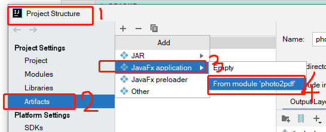

# README_DEV

## 环境
* 运行和构建项目环境 -- JDK8, maven3.8.4, intellij idea 2020.3
* 构建可安装 .exe 文件时需要的环境 -- JDK17

## intellij idea 构建项目的配置

注：
 1. 需要将 output layout 中绿色框框中的依赖全部添加到红色框框当中， 如果有特殊的依赖包或者文件可以点击黄色箭头的+按钮添加你的特殊的文件添加到输出的层中（补充：output layout
的设定是将项目所有依赖的包、文件或者其他的东西在打包输出氏一并输出到打包的目标文件当中，如果不再这里指定那么打包出来的文件在运行程序时将会找不到项目中需要的文件而导致程序运行异常）

 2. 如果本项目是在 Mac 上构建，那么此时在 photo2pdf/out/artifacts/photo2pdf/bundles 目录下已经有可以直接在Mac安装使用的 photo2pdf-22.01.dmg 安装包了。

## 构建项目为 exe 可执行文件
* Step1:

* Step2:

CMD 窗口执行(命令中的JDK17的路径需要更换为你的具体路径):
set JAVA_HOME="C:/Program Files/Java/jdk-17.0.1

* Step3:
执行以下命令既可以将exe制作成可安装的exe（需要先安装 wix toolset）:  
在 photo2pdf/out/artifacts/photo2pdf/bundles 目录下执行以下命令  
jpackage -n photo2pdf --app-image ./photo2pdf --vendor photo2pdf --app-version 22.01 --icon ./photo2pdf/photo2pdf.ico --dest ./target/build-link-package --temp ./target/build-link-package/temp --win-dir-chooser --win-menu --win-menu-group photo2pdf --win-shortcut

* Step4:
编译生成的安装包的保存位置为：
photo2pdf/out/artifacts/photo2pdf/bundles/target/build-link-package/
 然后如同往常安装 windows 软件一样安装 photo2pdf-22.01.exe 即可使用！

### 开发指令
在首页--封面设置--描述 输入以下命令，将会触发开发相关的行为
**##devmode=true  -- 开启开发模式，将会在【设置】页看到一些日志信息
**##devmode=false  -- 关闭开发模式，将会关闭在【设置】页看到一些日志信息画面
**##threadpoolcore=8  -- 手动配置用于处理图片的线程池的线程数量，这里设置为8
**##clearcache  -- 手动清理程序产生的所有缓存文件(包括key)